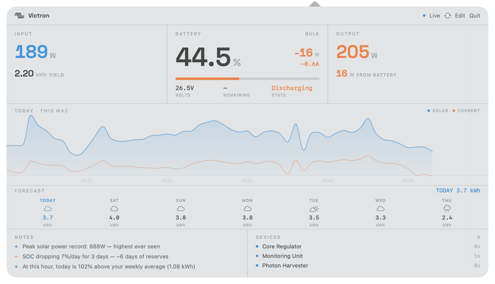
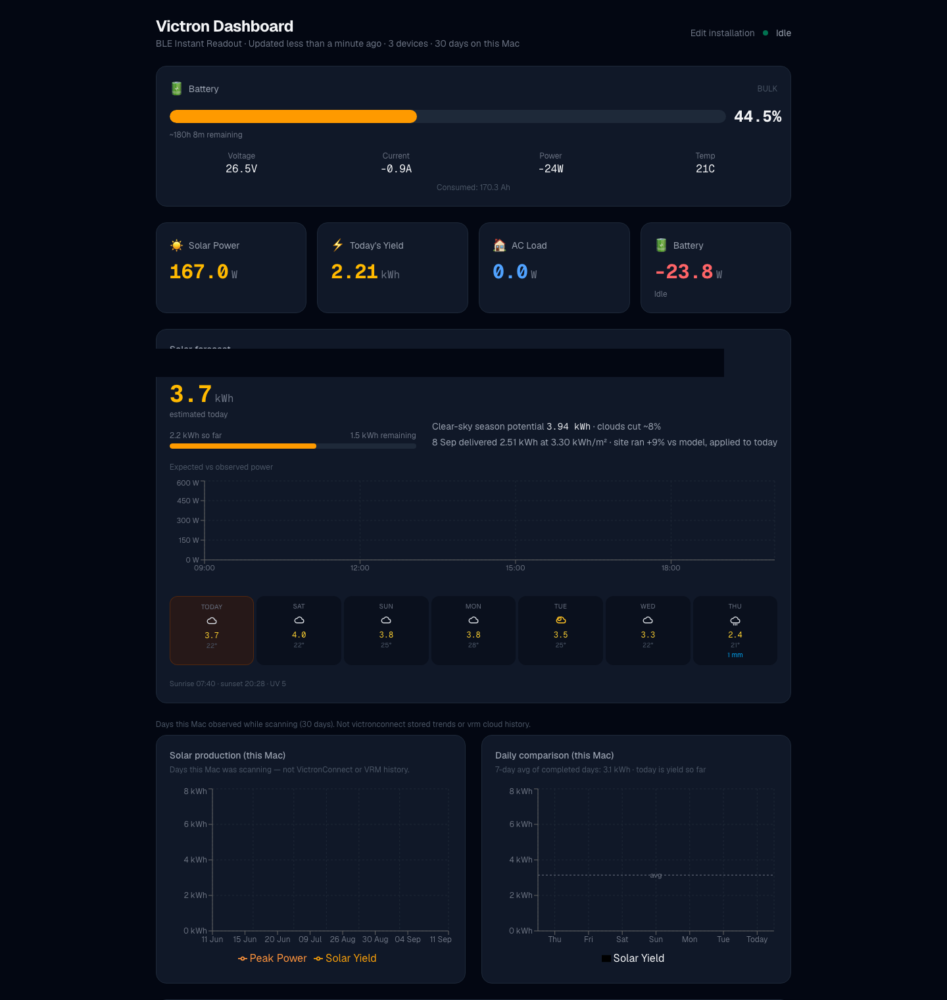

# Victron BLE dashboard

Live battery and solar numbers from your Victron kit, over Bluetooth. No Cerbo/GX. No VRM account.

A **macOS menu-bar app** and a **local web dashboard** for van, boat, and cabin Instant Readout kits (SmartSolar, BMV / SmartShunt, BMS, MultiPlus, and similar) with a Mac nearby.

The menu-bar bolt is **blue when charging** and **orange when discharging**.

<p>
  
  
</p>

Charging (blue) · Discharging (orange, live)





This is not a VictronConnect replacement. Copy Instant Readout keys from VictronConnect once. Keys stay on the Mac.

## Platforms

- **macOS** — menu-bar widget + Python BLE reader
- **Browser** — dashboard at `http://localhost:3000` on that Mac
- **iOS (optional)** — Lock Screen / Home Screen widget on your LAN
- Not a first-class Windows or Linux app

## Setup

You need Node.js 20+, Python 3.10+, and VictronConnect (for the keys).

```bash
git clone https://github.com/antoninnehring/victron-ble-dashboard.git
cd victron-ble-dashboard/victron-dashboard
npm install
pip3 install -r ble-reader/requirements.txt
```

1. **Keys** — VictronConnect → device → Settings → Product Info → Instant Readout. Then quit VictronConnect so it doesn’t steal Bluetooth.
2. **Reader** — `python3 ble-reader/reader.py` (leave it running).
3. **Dashboard** — `npm run dev`, then open [http://localhost:3000](http://localhost:3000). A setup wizard scans for devices and saves them to `victron-config.json` (gitignored).

That’s it. Re-open the wizard with **Edit installation**, or **Edit** in the menu-bar panel.

### Menu bar

```bash
cd VictronWidget
swift build -c release
.build/release/VictronWidget
```

It reads the same `ble-data.json` the reader writes.

### iPhone widget (optional)

```bash
cd VictronWidgetIOS
xcodegen generate
open VictronWidget.xcodeproj
```

Point the app at `http://<your-mac-lan-ip>:3000`. Keys never leave the Mac.

## If something’s wrong

- No devices in the scan — Instant Readout on, gear powered, Bluetooth on, VictronConnect quit.
- Dashboard says no BLE data — the reader must be running from `victron-dashboard/`.
- Forecast looks lost — set `SITE_LAT` / `SITE_LON` in `.env.local`, or let it use this Mac’s public IP.
